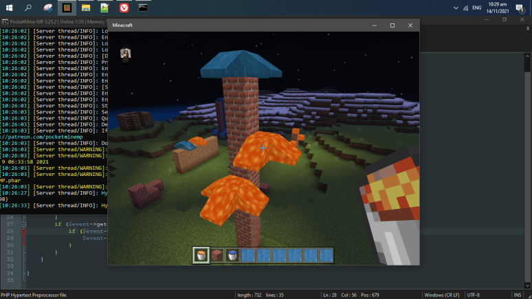

# AntiLiquidFlow
A Simple PocketMine-MP Plugin that prevents liquid to spread

 

## 🛠️ Features:

- Stop players from easily griefing
- Control your fluid in your server

## About AntiLiquidFlow:
- AntiLiquidFlow is great for all gamemodes to prevent spreading the Liquid inside the game.

 

# 🔧 How to install AntiLiquidFlow? 
How to install EventBonus?
1) [Download](https://poggit.pmmp.io/ci/Lentou/AntiLiquidFlow/~) latest stable version from poggit  
2) Move dowloaded file to your server **/plugins/** folder  
3) Restart the server and enjoy!

 
## Example: 

Full license [here](https://github.com/Lentou/AntiLiquidFlow/blob/main/LICENSE).
